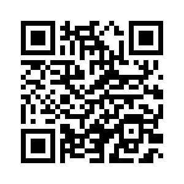

class: middle, center  
# Agile for Automotive 2019  
## Matt Blackburn  

---

# .center[A Little about Myself]
## Professional
* Software Engineer At Ford Motor Company
* Certified **Scrum Master**
* Certified **Github For Developers Trainer**
* 28 year of expierence in various industries
--

* Next job needs to be in the **Aerospace** Industry
---
.center[]
.footer[.center[Image Source: https://www.imdb.com/title/tt0093748/mediaviewer/rm1855067136]]
---

# .center[A Little more about Myself]
## Hobbies
* Adventure Motorcyle Riding
* Hanging with kids
* 1990s and Retro Video Games

## Current Favorite Quote
*  **Never say Never**  

--

.center[I **Never** wanted to move **East** of Lansing]
--

.center[I **Never** wanted to work for an **Automotive** company]
--

.center[I am having more **FUN** than I should be allowed to have]

---

# .center[This presentation]

* Meant to be a **Participation Event**
* Point Of View: **Software Engineer** who became a **Scrum Master**
* Hosted on **GitHub** using **GitHub Pages**
* Presentation Engine is [Remark.js](https://remarkjs.com/#1)
* URL of this presentation is: https://blackbms.github.io/AutomotiveAgile2019/  

---
# .center[Buzzword Bingo]
???
Every Agile Presenation has to at least mention these next few items.
---
# .center[Buzzword Bingo]
## .left[SCRUM]
---
# .center[Buzzword Bingo]
#### .left[SCRUM]
## .right[KANBAN]
---
# .center[Buzzword Bingo]
#### .left[SCRUM]
#### .right[KANBAN]
##  .center[LEAN]
---
# .center[Buzzword Bingo]
#### .left[SCRUM]
#### .right[KANBAN]
#### .center[LEAN]
##  .left[SPRINT]
---
# .center[Buzzword Bingo]
#### .left[SCRUM]
#### .right[KANBAN]
#### .center[LEAN]
#### .left[SPRINT]
##  .right[SAFE]
---
# .center[Buzzword Bingo]
#### .left[SCRUM]
#### .right[KANBAN]
#### .center[LEAN]
#### .left[SPRINT]
#### .right[SAFE]
## .center[XP]
---
# .center[Buzzword Bingo]
#### .left[SCRUM]
#### .right[KANBAN]
#### .center[LEAN]
#### .left[SPRINT]
#### .right[SAFE]
#### .center[XP]
## .left[Fail Fast]
---
# .center[Buzzword Bingo]
#### .left[SCRUM]
#### .right[KANBAN]
#### .center[LEAN]
#### .left[SPRINT]
#### .right[SAFE]
#### .center[XP]
#### .left[Fail Fast]
## .center[Insert Flavor of the Month]
---
# .center[Now the REAL Title of this Workshop]
---
# .center[Now the REAL Title of this Workshop]

# .middle[.center[AGILE!!]]
---
# .center[Now the REAL Title of this Workshop]

# .middle[.center[AGILE, WHY I HATE IT!!]]
---

# .center[Why Management wants to DO Agile]
--

* ## Faster To Market
--

* ## Respond to Change Quicker

--

# .center[Why do they think these things?]

--

* ## Had Dinner with an Agile Consultant

---
# .center[Now that we are doing Agile]
--

## .center[How do Developers feel that it is being rolled out?]
--

### .center[Meet the New Scrum Master]
--

.center[]
.center[**Lucille**]
---

# .center[Have you heard the following?]
--

### Agile = SCRUM
--

### Agile = KANBAN
--

### We use <b>Insert Tool Here</b> So we are Agile
--

# .center[Remember]
--

### .center[Agile isn't something you <b>DO</b>  ]
--

### .center[Agile is something you <b>ARE</b>  ]

---

# .center[Common Misconceptions]  
--

### It is the Wild Wild West there is no planning 

--
### .right[Agile requires Constant planning]

--

### We don't need to do documentation

--

### .right[We still do documenation, but the Necessary documentation]

---
# .center[Agile and Agility is HARD]
--

* **People want to paint the house before it is built**  
   * We need all the requirements for the end product before we can start developing  
--

* **Malicious Compliance**
   * Well, since Managment wants to Micromanage me I will put in a User Story in for everything, including breaks I take  
--

* **Watching People Fail is hard**
   * It is hard to let people fail and learn, rather than try and jump in and attemp to solve their problems.  After all we are engineers  
--

* **Batteries are not included**  
   * Find resources inside and outside your organization to help you rechage your batteries
      * There are a lot of good **MeetUp** groups in the Detroit area  
      * If there isn't one in your Organization, create one
   * There really isn't a 1 size fits all solution, don't be afraid to adapt to your situation  
--

## .left[Only works when everyone is Fully Invested]
---
-exclude: true
# .center[Let's Get to Know Each Other A Little]

## Constellation Exercise
http://anagilemind.net/2019/02/20/team-building-icebreaker-constellation-exercise/  

### Situations you might use it in
* Team Building (during a team launch or reboot)
* Start of meeting (i.e. retrospective)
* Gain consensus when team has high trust and psychological safety. If you don’t have these, then some team members may just follow the crowd
---
## Constellation Exercise
### Basics of the Activity
1. Clear a decent size space for the amount of people in the exercise to move around  
1. Place an object as the center of universe (i.e. roll of masking tape, paper plate, fidget toy).
Form circle around the center of universe  
1. Make statement (see examples below)  
1. Move based on level of agreement. If you strongly agree, move very close to the center of the universe. If you strongly disagree, move very far from the center of the universe. Don’t be surprised if some people will almost want to go through a wall to get further from the center of the universe  
---
## Constellation Exercise
### Sample Starter Statements
1. I enjoy political conversations  
1. I enjoy public speaking  
1. I believe we are producing a high quality product  
1. I feel confident we can complete the stories for this sprint (if you are working in a Scrum framework)  
1. I like team building exercises  
1. I love country music  

---
# Lean Coffee
A “Lean Coffee is a structured, but agenda-less meeting. Participants gather, build an agenda, and begin talking. Conversations are directed and productive because the agenda for the meeting was democratically generated.”  - *From the Lean Coffee website*

---
# Lean Coffee

### The Setup is a Personal Kanban
In this Personal Kanban we have the items to discuss, what we are currently discussing, and the discussed columns.

This provides a structure for the conversation. Next we populate it
--

### What To Discuss
Everyon gets a pad of post-it notes and a pen. They then start to add their topics for conversation into the “to discuss” column. These can be literally whatever people want to discuss or follow a theme. Right now, we want to encourage as many unique ideas as we can.

When the ideas start reach a certain point (an you’ll be the best judge of when that is), each topic gets a 1 to 2 sentence introduction. This way people know what to vote for.

---
# Lean Coffee

### Vote and Talk
Each participant gets two votes. You can vote twice for the same thing or for two different topics. Simple put a dot on the sticky you are interested in. Tally the dots. Then you are ready to have a conversation.

The power here is that you now have a list of topics everyone at the table is interested in and is motivated to discuss for real.

---
# Lean Coffee
### Discussion
* Will discuss the hight priority topic for 5 minutes
* At the end of the time box, will take a simple Roman Thumb Vote (Thumbs Up/Down/Sideways)
   * Thumbs Up: Continue talking on topic.  Reset Timer to 3 minutes.
   * Thumbs Down: Satisfied with the current discussion, let's move on to the next topic.
   * Thumbs Sideways: Could go either way Up or Down 
* Repeat until we are out of time or topics
---
# .center[Thank You For Attending]

.center[URL of this presentation is: https://blackbms.github.io/AutomotiveAgile2019/  
]

#### My Contact Information:
   Matt Blackburn  
   matt.blackburn@ford.com
---
exclude: true
# Test Page
.right[Right Text]  
.left[Left Text]  
.center[Center Text]  
